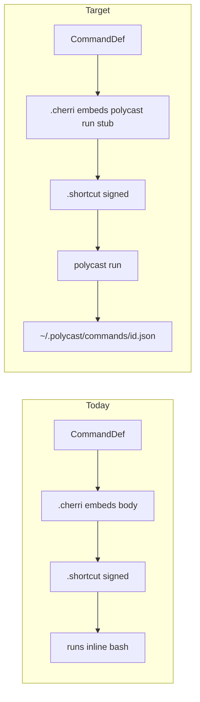

# Plan — Shortcuts Cherri thin-shim dispatcher

**Date:** 2026-06-15
**td:** td-de7b0a
**Epic:** td-cac272 (Post-launch engineering)
**Status:** ready for ce-work

## Problem

Raycast, PopClip, Dropzone, Dropover, and agent-cli emitters install **dispatcher
stubs** that call `polycast run` against the JSON command store
(`~/.polycast/commands`). Body edits sync via `apply --write` without touching
installed launcher files.

**Shortcuts Cherri still inlines `body.source`** at compile time inside
`runShellScript(...)`. Consequences:

| Issue | Impact |
|-------|--------|
| Body change requires `cherri` recompile + Shortcuts re-import | Heavy operator loop |
| `apply` does not sync commands JSON for shortcuts-only apply | Inconsistent with other surfaces |
| MCP `polycast_command_upsert` body edits invisible to Shortcuts | Agent-native gap |

LAUNCH_CRITERIA lists extending thin-shim to `shortcuts-cherri` as post-launch
work (non-goal for v1 launch — now unblocked).

## Goal

Emit Cherri that **delegates to `polycast run`** (same contract as
`src/shim.ts`), and include `shortcuts-cherri` in `DISPATCHER_TARGETS` so
`apply --write` syncs the JSON store.

**Success:** After one-time shortcut import, editing
`~/.polycast/commands/<id>.json` (or upsert via MCP) changes Shortcuts behavior
without recompile/re-import — matching agent-cli proof in
`test/run.test.ts`.

## Non-goals

- Files modality for Shortcuts (unchanged skip)
- Dropdown args (unchanged skip)
- Eliminating Cherri compile step (still need `.cherri` → `.shortcut` for import)
- Shortcuts programmatic import without user confirmation

## Current vs target

## Design

### 1. Shim helpers in `src/shim.ts`

Add Cherri-oriented builders (return **unescaped** bash for `escapeCherriString`):

| Helper | Modality | Shell inside `runShellScript` |
|--------|----------|-------------------------------|
| `shortcutsTextShim(cmd)` | `text` | `DISPATCHER_RUN_PREFIX` + read stdin + `run … --text "$TEXT"` (mirror `popclipScriptShim`) |
| `shortcutsArgsShim(cmd)` | `args` | `DISPATCHER_RUN_PREFIX` + `set -- …` + `run … "$@"` (prompts stay in Cherri) |
| `shortcutsNoneShim(cmd)` | `none` | `DISPATCHER_RUN_PREFIX` + `run …` |

**Text input:** Cherri passes `ShortcutInput` as stdin to the shell script when
the second `runShellScript` argument is `ShortcutInput` (same as today's
`uppercase` — body uses stdin). Use `TEXT="$(cat)"` before `polycast run
--text`.

**Args input:** Keep existing Cherri `prompt()` + `set -- "{@polycast_arg_N}"`
lines **outside** the stub; only replace embedded body with `shortcutsArgsShim`
tail (`exec polycast run … "$@"`).

### 2. Emitter changes (`src/emitters/shortcuts-cherri.ts`)

- `text` / `none`: `runShellScript('${escapeCherriString(shim)}', ShortcutInput|nil, '/bin/bash')`
- `args`: unchanged prompt block + `runShellScript('${escapeCherriString(shortcutsArgsShim)}', nil, '/bin/bash')`
- Remove direct `cmd.body.source` from emitted Cherri (except none/text shims never include body)

### 3. Registry / apply

- Add `"shortcuts-cherri"` to `DISPATCHER_TARGETS` in `src/shim.ts`
- `applyBuilt` already syncs `commands/*.json` when any dispatcher target selected — no apply.ts logic change beyond membership
- Document: first apply after upgrade must re-import `.shortcut` once (stub changed); subsequent body edits are JSON-only

### 4. Operator requirements

| Variable | Purpose |
|----------|---------|
| `POLYCAST_BIN` | Absolute path to polycast CLI (Shortcuts may not inherit shell PATH) |
| `POLYCAST_COMMANDS_DIR` | Override JSON store (default `~/.polycast/commands`) |

Ties to **td-a23edf** (distribution / PATH). Plan assumes `POLYCAST_BIN` doc +
sample `export` in first-command guide follow-up.

### 5. Spec / docs updates

- `docs/specs/apple-shortcuts.md` — thin-shim templates replace inline body examples
- `docs/specs/destination-mapping.md` — `body.source` row → `polycast run` stub
- `LAUNCH_CRITERIA.md` — remove shortcuts from thin-shim non-goals when validated
- `docs/guides/first-command.md` — Shortcuts apply note (one-time re-import)

## Implementation units (ce-work)

| Unit | Work | Verify |
|------|------|--------|
| **U1** | `shortcutsTextShim`, `shortcutsNoneShim`, `shortcutsArgsShim` in `shim.ts` | Unit test shell strings contain `polycast run` + id |
| **U2** | Refactor `shortcuts-cherri.ts` to use shims | `test/emitters.test.ts` — cherri must **not** contain raw body; must contain `polycast run` |
| **U3** | Add `shortcuts-cherri` to `DISPATCHER_TARGETS` | Apply dry-run includes `commands-store` when targeting shortcuts |
| **U4** | Integration test: build shortcuts stub + JSON store + `polycast run` (no cherri compile) | New test in `test/run.test.ts` or operator-style test |
| **U5** | Docs + capability map + LAUNCH_CRITERIA | `./script/cibuild` |

Optional **U6** (P2): operator test with real `cherri` compile on macOS CI self-hosted — defer.

## Risks

| Risk | Mitigation |
|------|------------|
| `POLYCAST_BIN` unset in Shortcuts | Document absolute path; future td-a23edf wrapper |
| Cherri string escape regressions | Reuse `escapeCherriString`; snapshot cherri output in tests |
| Users on old inline shortcuts | One-time re-import called out in apply note + guide |
| `cherri` absent on CI | Structural tests on `.cherri` source only (existing pattern) |

## Open questions

1. **Default `POLYCAST_BIN`:** keep `polycast` on PATH vs embed `bun run …` from build machine? → Prefer `polycast` + distribution story; avoid baking dev paths into signed shortcuts.
2. **Re-import UX:** append apply note `"Re-import .shortcut once after thin-shim upgrade"` when shortcuts target selected?

## References

- [`src/shim.ts`](../../src/shim.ts) — existing dispatchers
- [`src/emitters/shortcuts-cherri.ts`](../../src/emitters/shortcuts-cherri.ts)
- [`docs/specs/apple-shortcuts.md`](../specs/apple-shortcuts.md)
- [`test/run.test.ts`](../../test/run.test.ts) — JSON store round-trip proof
